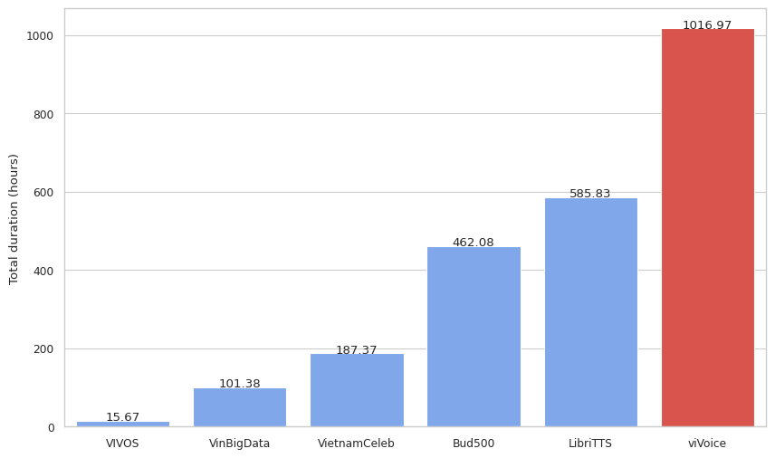
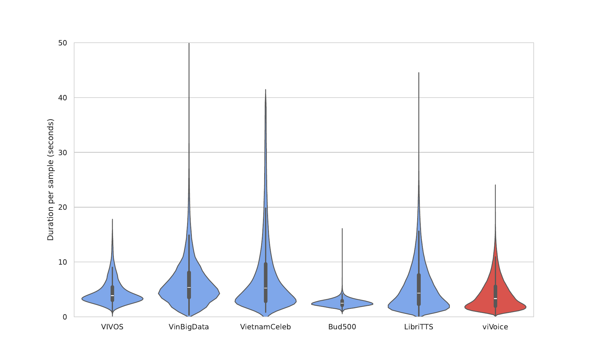
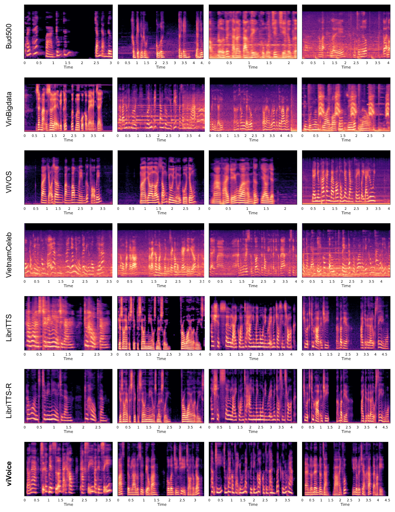
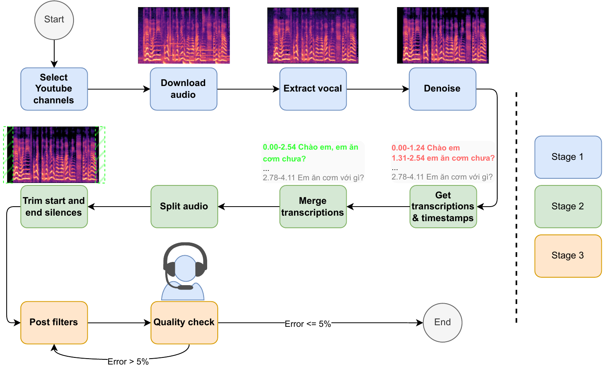

# viVoice: Enabling Vietnamese Multi-Speaker Speech Synthesis

## Introduction 👋

[Introduction Video  (Vietnamese)](https://youtu.be/NVwgvTiIRCM)

*Figure 1: Total duration of the viVoice dataset (1,017 hours) compared to other multi-speaker Vietnamese speech datasets. The LibTTS dataset is included for reference purposes.*

This work introduces viVoice, the first publicly available large-scale Vietnamese speech dataset designed to advance research in Vietnamese text-to-speech (TTS) systems. The viVoice dataset comprises over 1000 hours of high-quality, cleaned audio from Youtube, and accompanying transcriptions sourced from 186 Youtube channels. This dataset addresses the critical scarcity of Vietnamese TTS data, offering a substantial resource for the development and refinement of speech synthesis models. The study also introduces [viXTTS](https://github.com/thinhlpg/vixtts-demo/), the first publicly available Vietnamese TTS model featuring voice cloning and multilingual capabilities achieved through fine-tuning [XTTS](https://huggingface.co/coqui/XTTS-v2) with the viVoice dataset. Evaluations using Mean Opinion Scores (MOS) show that viXTTS checkpoints, trained on a 350-hour subset of viVoice, score 0.3 points higher in naturalness and similarity compared to training on the [BUD500](https://github.com/quocanh34/Bud500) dataset, although they still fall short of human-level performance.

It is essential to acknowledge that certain **limitations do persist** and are documented in later sections. We also release a smaller dataset version, [viVoice Distil](https://huggingface.co/datasets/thinhlpg/vivoice-distil), which is an exploratory attempt to improve the consistency of the dataset by normalizing abbreviations and numbers, and keeping punctuation, through prompting the GPT-3.5 API with additional transcripts.

Both the viVoice corpus and the viXTTS model were prepared end-to-end by [Thinh Le](https://www.facebook.com/thinhlpg/) as part of his team's Graduation Thesis at FPT University HCMC. This dataset is licensed under [CC-BY-NC-SA-4.0](https://spdx.org/licenses/CC-BY-NC-SA-4.0) and is intended for research purposes only. You can access the dataset on the [Hugging Face Hub](https://huggingface.co/datasets/capleaf/viVoice); your contact information is required.

### Dataset Structure

```
{
  'channel': '@channelID',
  'text': 'Xin chào, chúc bạn một ngày tốt lành.',
  'audio': 
    {
      'path': 'audio_xx.xx_xx.xx.wav', // This has no use
      'array': array([ 0., 0., 0., ..., -0.00054932, -0.00054932, -0.00057983]),
      'sampling_rate': 24000
    }
}
```

### Data Access & Usage

- This dataset is only to be used for research purposes. **Access requests must be made via your school, institution, or work email**. Requests from common email services will be rejected. We apologize for any inconvenience.
    - <https://huggingface.co/datasets/capleaf/viVoice>
    - <https://huggingface.co/datasets/thinhlpg/vivoice-distil>

- ✨ You can quickly try the dataset with this Notebook: [](https://colab.research.google.com/drive/15-8kQ0QrZONIjYuKl__m_XyiqBZmoQa6?usp=sharing)

## Key Features and Statistic 📊

- **All audio is cleaned from noise and music.**
- **Clean cuts are made at the beginning and end of sentences to eliminate any unnecessary silences or disruptions, while avoiding cutting in the middle of words.**
- Sourced from 186 YouTube channels, with channel IDs included for transparency.
- Number of samples: 887,772
- Total duration: 1,017 hours
- Sampling rate: 24 kHz
- Number of splits: 1 (train only)
- Size: 169 GBs
- Gender distribution of speakers: 61.3% ± 3.02% male (manually estimated from a sample of 1,000 with a 95% confidence interval)
- Estimated transcription error rate: 1.8% ± 0.82% (manually estimated from a sample of 1,000 with a 95% confidence interval)
    - This metric is for quick reference purposes only; users of this dataset should carefully inspect it to ensure it meets your requirements.
    - The error rate only accounts for sentences with mistranscriptions (more or fewer words than expected).
    - Other errors, such as missing punctuation or incorrect but phonetically similar words, are not counted.

## Exploratory Data Analysis 🔎


*Figure 2: Violin plots illustrate the distribution of utterance durations across various speech corpora. The y-axis is capped at 50 seconds to improve visualization.*


*Figure 3: A comparison of mel-spectrograms reveals that viVoice samples exhibit low noise and minimal leading/trailing silence, characteristics comparable to those found within the LibriTTS-R datasets.*

## Data Creation Pipeline


*Figure 4: The dataset creation pipeline includes three main stages.*

### Stage 1: Data Acquisition and Preprocessing

- Audio data was downloaded from 186 Vietnamese YouTube channels covering various genres.
- The [UVR-MDX-Net-Voc_FT](https://mvsep.com/en/algorithms) model was used to extract vocal tracks and remove background music/noise.
- [DeepFilterNet3](https://github.com/Rikorose/DeepFilterNet) was employed for advanced noise removal while preserving speech quality.
- Audio was converted to 24kHz, 16-bit PCM, mono-channel format.

### Stage 2: Obtaining Transcription & Timestamps and Split Audio

- Transcriptions and timestamps were generated using the [Whisper Large V3 model](https://huggingface.co/openai/whisper-large-v3).
- A rule-based approach was developed to merge fragmented transcriptions into cohesive sentences.
- The long audio files were split based on timestamps.
- [Silero VAD](https://github.com/snakers4/silero-vad) was utilized to identify and trim leading/trailing silence with padding.

### Stage 3: Post-Filtering and Quality Assurance

- Strict filtering criteria were applied to remove samples with excessively long transcriptions, prolonged silence, or high speech rates, which were inspired by the methodology of [LibriTTS](https://google.github.io/df-conformer/librittsr/).
- Duplicate samples were removed.
- A second-pass transcription using [PhoWhisper-base](https://github.com/VinAIResearch/PhoWhisper) was performed for additional filtering based on transcript discrepancies.
- Manual quality checks were conducted using a custom Streamlit application, where annotators inspected audio waveforms, spectrograms, and transcriptions.
- Iterative refinement of filtering rules was performed to achieve a final error rate below 5%. This process involved systematic inspection and analysis of audio samples. *The method used for this was executed heuristically, relying on practical experience, common sense, or judgment rather than purely logical deduction or mathematical calculation.*

## Known Limitations and Future Work Suggestions ⚠️

- The text is not normalized, so it might not be suitable for some types of TTS or STT models that require a one-to-one mapping between text and audio.
- The audio waveform is not normalized; this may result in distortion, clipping, too loud, or too quiet, etc.
- The dataset is imbalanced; some channels consist substantially more samples than others. This is due to lack of experience and some mistakes made at the beginning of the data collection process.

### viVoice Distil 💧

- Future work could use phowhisper-small or base model to get the unnormalized text, then prompt the GPT3.5 model to make it act as a text normalizer/aligner. Align this original transcription with the unnormalized transcription, resulting in a sentence that keeps punctuation and has numbers or abbreviations normalized.
- [viVoice Distil](https://huggingface.co/datasets/thinhlpg/vivoice-distil) is an implementation of this method; it selects less than 500 utterances containing commas from each channel. However, this attempt failed because the prompt wasn't tested well enough, which resulted in some misaligned or wrong transcription sentences. The used prompt is included in the Hugging Face repository.

## Acknowledgement ✨

I would like to express my gratitude to my teammates [vTuanpham](https://github.com/vTuanpham) and [hungnq1310](https://github.com/hungnq1310) for staying overnight in the coffee shop with me 💖, to our supervisors for the guidance, to the family and friends who believed in us, and finally, to all the wonderful technologies that made this project possible!

## Citation

```bibtex
@misc{viVoice,
  author = {Thinh Le Phuoc Gia, Tuan Pham Minh, Hung Nguyen Quoc, Trung Nguyen Quoc, Vinh Truong Hoang},
  title = {viVoice: Enabling Vietnamese Multi-Speaker Speech Synthesis},
  url = {https://github.com/thinhlpg/viVoice},
  year = {2024}
}
```

A manuscript and a friendly dev log documenting the process might be made available later (including other works that were experimented with, but details about the filtering process are not specified in this README file).

## Contact 💬

- Facebook: <https://fb.com/thinhlpg/> (preferred; feel free to add friend and message me casually)
- GitHub: <https://github.com/thinhlpg>
- Email: <thinhlpg@gmail.com> (please don't; I prefer friendly, casual talk 💀)
